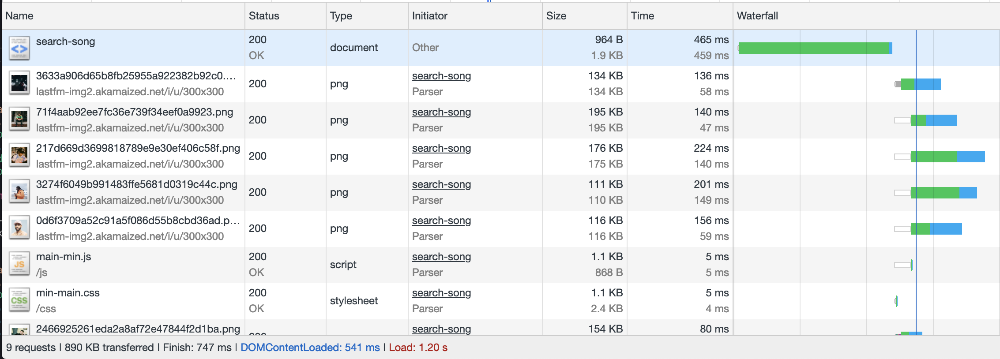
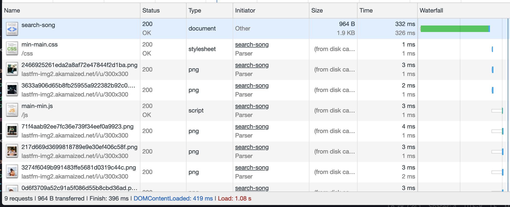
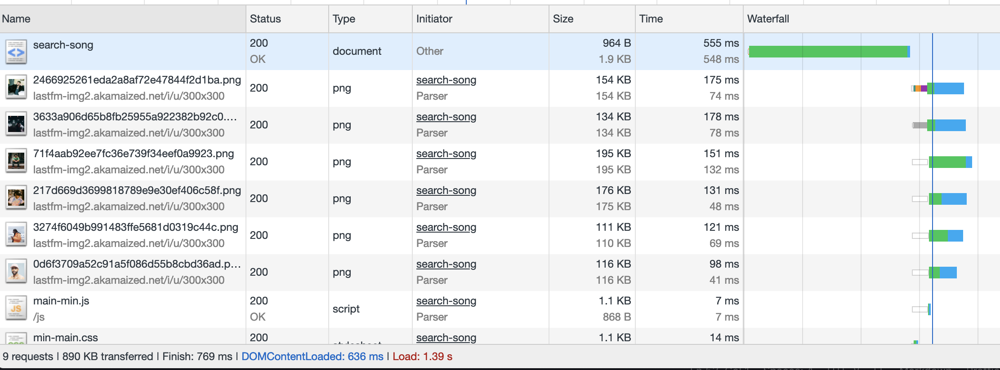

# Performance matters

### Minify

Used gulp for minify my static javascript
Used node-sass to minify the sass to css compressed

Both can be run with `npm run minify`

##### CSS


#### JS


**Conclusion:** Well.. my files are really small it does some minification and as the files grow bigger it can help mnuch more.

### HTTP Caching

Well it speaks for itselfs when you cache your files

Easiliy done with some middleware with express

```js
app.use(
  express.static(__dirname + '/dist', {
    maxAge: '365d',
    lastModified: '',
    etag: ''
  })
)
```

#### Without cache



#### With cache



**Conclusion:** as you can see all the files are stored in the cache. For the first request it doesn't really matter at all. But when the visitor returns it has a year the files in the cache and can load it instantly (1ms) the files.

#### Handlebars caching

As they say themselves they use a 'a smart template caching strategy`.
Sadly it doesn't have much documentation about it and I still need to figure out what it does exacly. [Link to docs.](https://www.npmjs.com/package/express-handlebars#template-caching)



**Conclusion:** I really don't have a idea why it's slower than without it. But it's hard to test and maby it has something to do with production mode? Don't know honestly...
